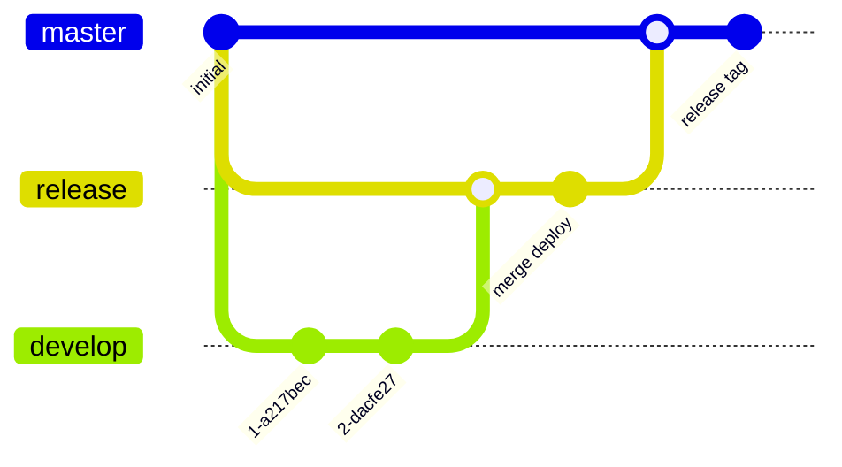

# 💎forge
- デプロイ環境とプロビジョニングSDKを提供します
- サーバ用dotfilesも備わっています

## 🛠️📦`forge`コマンドの導入
### ローカルへのコマンド導入
以下をターミナルへペーストし、SDK操作インターフェースをパッケージした`forge`コマンドを導入できます
> [!Tip]
> - MacOS前提となります(brew installを用いている部分のみです)
> - git ghの導入と初期化が済んでいる前提です
> - 使用法は`forge -h`で確認できます
```sh
gh api -H "Accept: application/vnd.github.raw" -H "X-GitHub-Api-Version: 2022-11-28" "/repos/serna37/easy-provi/contents/forge.sh?ref=main" > /usr/local/bin/forge && chmod +xw /usr/local/bin/forge
```

> [!Note]
> - `forge`が依存: `git` `gh`
> - なければ入る: `gum` `jq` `genact`

### サーバへの初期セット
デプロイ先のサーバに対し、このリポジトリをクローンしておく必要があります(以下はdotfiles部分の適用まで行っています)
```sh
git clone https://github.com/serna37/easy-provi.git ~/git/easy-provi
cp ~/git/easy-provi/server/.vimrc .
cp ~/git/easy-provi/server/.bashrc .
cp ~/git/easy-provi/server/.toprc .
source ~/.bashrc
```


## ⚙️開発支援内容
<details>
<summary>新規リポジトリ作成と初回サーバデプロイ</summary>

---
### プロビジョニング: `forge gen`
- テンプレートリポジトリから新規リポジトリを作成
- サーバへの初回デプロイが可能(optional)
- フロントのみデプロイも可能

| 項目 | 状態 |
|--------|--------|
| アプリ画面 | `https://xxxx.com/{リポジトリ名}/index.html` |
| WebAPIパス | `https://xxxx.com/{リポジトリ名}/api/{自由}` |
| ホスティング | Dockerコンテナ起動, apacheからリバースプロキシ |
| 使用ポート | `8080`からインクリメントし, デプロイ時に使用可能なものを自動選択 |

### 初回デプロイ: `forge init-deploy`
- リポジトリ作成後にデプロイしなかった場合、初回デプロイのみを実行できます

---
</details>

<details>
<summary>ローカル開発用のコンテナ起動</summary>

---
### ローカル開発: `forge [run|stop]`
`forge`ではPython仮想環境を起動してvimに入る

`forge [run|stop]`は以下の制約のもとコンテナを制御する (各テンプレートリポジトリが満たしておくと良いです)
- フロント: **静的ファイル**での開発とし, サーバ起動の開発はサポートされない
- フロント: コンテナ内`3000`ポートで起動
- バックエンド: サーバは**ホットリロード**を採用
- バックエンド: サーバはコンテナ内`8080`ポートで起動
- フォルダ構成は以下
- 必要に応じ、手動でテンプレートリポジトリをメンテナンスする
```
最低限の構造
.
├── back/
│   └── app/
│       └── Dockerfile
└── front/
    └── Dockerfile
```

```
推奨される構造サンプル
.
├── back/
│   ├── app/      ─── コンテナにバインドマウント
│   │   ├── db/
│   │   │   ├── データスキーマ本体
│   │   │   └── init.json (初期投入データなどのイメージ)
│   │   ├── src/
│   │   │   ├── api/
│   │   │   │   └── エンドポイントサービス
│   │   │   ├── batch/
│   │   │   │   └── バッチ処理系
│   │   │   ├── lib/
│   │   │   │   └── 共通処理系
│   │   │   ├── crontab
│   │   │   └── crontab_update.sh
│   │   ├── test/
│   │   │   ├── conftest.py
│   │   │   └── 各テストコード
│   │   └── main.py
│   └── Dockerfile
└── front/        ─── フロントに配置(Dockerfile以外)
    ├── index.html
    ├── icon.png
    ├── 処理系js
    └── Dockerfile
```

---
</details>


<details>
<summary>CI/CDでサーバ側更新</summary>

---
### CI/CD: `forge release`
- ブランチごとに手動/自動でテスト/リリースのGitHub Actionsを使用するとよいです
- 基本的にリモートサーバ上でpullとcpするだけ
- Actionsファイルは必要に応じて修正する
- `forge release`は`develop`->`release`->`master`と順次マージしていく
- 推奨構成は以下

| ブランチ | Actions | Misk |
|--------|--------|--------|
| develop | 自動テスト, 手動デプロイ | |
| release | 自動デプロイ, 手動デプロイ | |
| master | なし | forgeからタグ+リリース |



---
</details>


